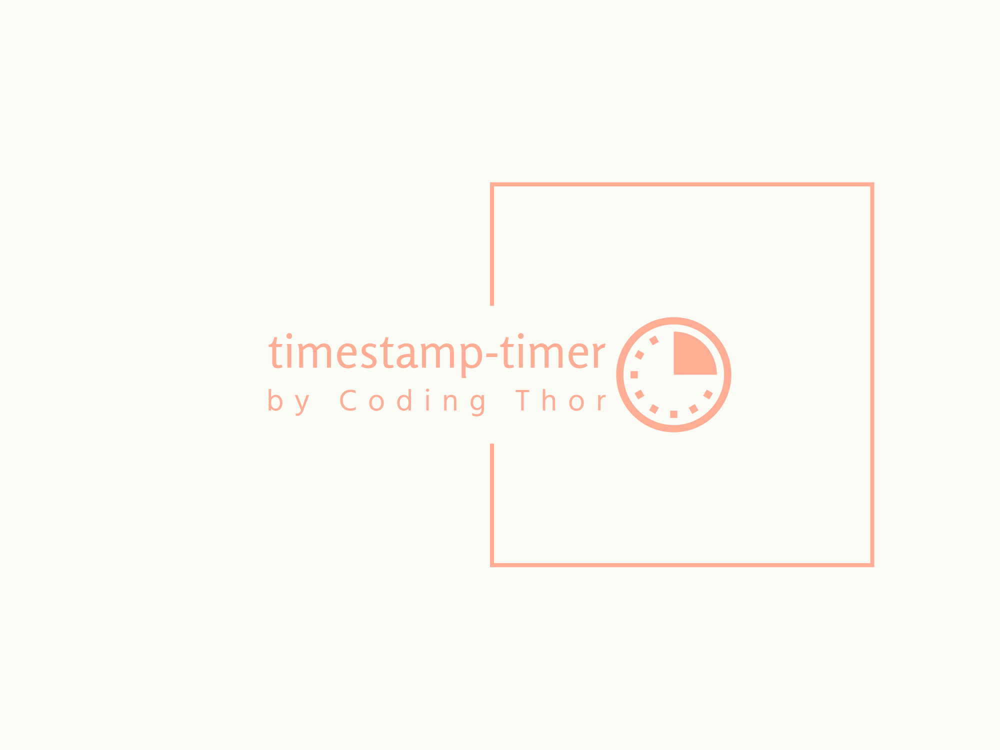

# timestamp-timer



A Custom Hook for Timer in react. 

## Installation

You can install `timestamp-timer` using npm:

```bash
npm install timestamp-timer
```

Example:
```javascript
import React from 'react';
import useTimestampTimer from 'timestamp-timer';

function MyComponent() {
  const initialTimestamp = new Date().getTime(); // Replace this with your timestamp logic
  const elapsedTime = useTimestampTimer(initialTimestamp);

  return (
    <div>
      Elapsed time: {elapsedTime} milliseconds
    </div>
  );
}

export default MyComponent;
```
Hook will actually return the in milliseconds u can convert it to any format u want an example:
```javascript
    const formatTime = (milliseconds) => {
      const seconds = Math.floor(milliseconds / 1000);
      const minutes = Math.floor(seconds / 60);
      const hours = Math.floor(minutes / 60);
      const days = Math.floor(hours / 24);
  
      return `${days}:${hours % 24}:${minutes % 60}:${seconds % 60}`;
    };
```